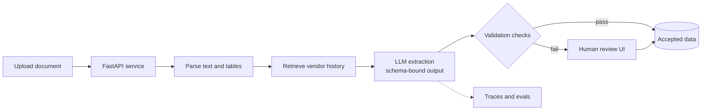

# Invoice Desk


**Invoice Desk** turns invoice documents into validated, structured data. A document is uploaded, an LLM extracts the fields against a strict schema, automated checks catch inconsistencies, and a reviewer corrects anything uncertain before it is accepted.

The project is built end to end: Python APIs, a document-processing pipeline, a TypeScript/React/Next.js review interface, and an LLM workflow with structured outputs, retrieval, tool use, evaluations, and observability.

---

## Table of contents

- [Why this project](#why-this-project)
- [Current status](#current-status)
- [Architecture](#architecture)
- [Quick start](#quick-start)
- [Demonstrations](#demonstrations)
- [API reference](#api-reference)
- [Project structure](#project-structure)
- [Roadmap](#roadmap)
- [Design decisions](#design-decisions)

---

## Why this?

Extracting data from invoices looks simple, but real systems fail in predictable ways: totals that do not add up, dates in inconsistent formats, missing fields, and vendors spelled five different ways. Invoice Desk is designed around catching those failures rather than hiding them:

- **A single schema defines the data.** Pydantic models are the one source of truth for the invoice shape, so the API, the validation, and (later) the LLM output all agree.
- **Validation is separate from extraction.** Business rules, such as line items summing to the total, run on every result regardless of where it came from.
- **Humans stay in the loop.** Anything that fails a check is routed to review instead of being silently accepted.

## Current status

| Area | Status |
|---|---|
| FastAPI service with health, upload, and validation endpoints | Done |
| Pydantic invoice schema with business-rule check | Done |
| Automated API tests (pytest) | Written, run with `python -m pytest -v` |
| LLM extraction endpoint (`/extract`) | Planned |
| Synthetic invoice generator and evaluation set | Planned |
| Next.js review interface | Planned |
| Tracing, latency, and cost tracking | Planned |

This README only documents behavior that exists in the code today. Planned items are listed in the [roadmap](#roadmap).

## Architecture

The diagram shows the target design. Only the FastAPI service, the schema, and the validation step exist today; the rest are in progress.



## Quick start

**Requirements:** Python 3.11 or newer.

```bash
git clone https://github.com/Valentina14142000/invoice-desk.git
cd invoice-desk/backend

python3 -m venv .venv
source .venv/bin/activate        # Windows: .venv\Scripts\activate
pip install -r requirements.txt

python -m pytest -v              # run the tests
uvicorn main:app --reload        # start the API on http://127.0.0.1:8000
```

Open **http://127.0.0.1:8000/docs** for the interactive API explorer (Swagger UI), generated automatically from the code.

## Demonstrations

All examples run against the local server started in the quick start. Run them in a second terminal.

### 1. Health check

```bash
curl http://127.0.0.1:8000/health
```

```json
{"ok": true}
```

### 2. Catch an invoice whose total does not add up

The line items below sum to **147.50** (3 x 45.00 + 1 x 12.50), but the document claims a total of **150.00**:

```bash
curl -X POST http://127.0.0.1:8000/validate \
  -H "Content-Type: application/json" \
  -d '{
    "vendor": "ACME Supplies Ltd",
    "invoice_no": "A-1042",
    "date": "2026-09-28",
    "lines": [
      {"desc": "Toner cartridge", "qty": 3, "unit": 45.00},
      {"desc": "Delivery", "qty": 1, "unit": 12.50}
    ],
    "total": 150.00,
    "currency": "USD"
  }'
```

```json
{"valid": true, "totals_match": false}
```

The schema accepts the document (`valid`), but the business rule flags the mismatch (`totals_match: false`). In the planned pipeline, this is what routes an invoice to human review.

### 3. A consistent invoice passes

Change `"total"` to `147.50` in the request above:

```json
{"valid": true, "totals_match": true}
```

### 4. Malformed input is rejected

A line item with `"qty": 0` violates the schema (`qty` must be greater than 0), so the API returns **HTTP 422** with a detail message pointing at the offending field, before any business logic runs.

### 5. Upload a document

```bash
curl -X POST http://127.0.0.1:8000/documents -F "file=@sample-invoice.pdf"
```

```json
{"filename": "sample-invoice.pdf", "bytes": 48213}
```

The `bytes` value is the size of your file. At this stage, the endpoint only receives the file; parsing and extraction are the next milestones.

### 6. Interactive docs

Open `/docs` in a browser to try every endpoint from the UI.

## API reference

| Method | Path | Description | Success response |
|---|---|---|---|
| `GET` | `/health` | Liveness check | `{"ok": true}` |
| `POST` | `/documents` | Upload a file (multipart form field `file`) | `{"filename", "bytes"}` |
| `POST` | `/validate` | Validate an invoice JSON body and run the totals check | `{"valid", "totals_match"}` |

### Invoice schema

| Field | Type | Rules |
|---|---|---|
| `vendor` | string | required |
| `invoice_no` | string | required |
| `date` | string | required |
| `lines` | list of line items | required |
| `lines[].desc` | string | required |
| `lines[].qty` | number | must be greater than 0 |
| `lines[].unit` | number | must be 0 or greater |
| `total` | number | required |
| `currency` | string | defaults to `USD` |

**Business rule:** `sum(qty * unit)` over all lines must equal `total` within 0.01.

## Project structure

```
invoice-desk/
├── README.md
├── .gitignore
└── backend/
    ├── main.py            # FastAPI app and endpoints
    ├── schemas.py         # Pydantic models and the totals check
    ├── test_api.py        # pytest tests
    └── requirements.txt
```

## Roadmap

- [x] FastAPI skeleton, invoice schema, validation endpoint
- [x] Tests for the health check and the totals rule
- [ ] PDF text and table extraction, with an OCR fallback for scans
- [ ] `/extract` endpoint using Claude with schema-bound structured output and retries
- [ ] Synthetic invoice generator with ground-truth labels
- [ ] Evaluation harness reporting field-level accuracy, with a regression run on each prompt change
- [ ] Retrieval over past vendors to normalize names and categories
- [ ] Tool use (currency conversion, vendor lookup)
- [ ] Next.js and TypeScript interface: upload, plus a review screen with low-confidence fields highlighted
- [ ] Tracing for every pipeline step, with latency, token, and cost reporting
- [ ] Persistent storage (Postgres) and a background worker for processing

## Design decisions

- **Pydantic as the contract.** One model defines request validation, API docs, and later the LLM output format, which prevents the three from drifting apart.
- **Deterministic checks around a probabilistic model.** The LLM proposes values; plain code verifies them. This keeps failures visible and testable.
- **Evaluations before optimization.** A labeled synthetic dataset comes before prompt tuning so that every change can be measured.
- **Secrets stay out of the repo.** API keys belong in a local `.env` file, which is git-ignored.

## License

This project is licensed under the [MIT License](LICENSE).
